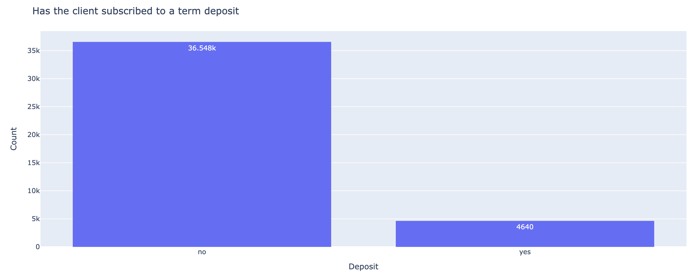
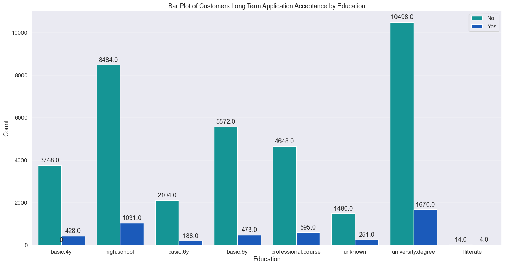
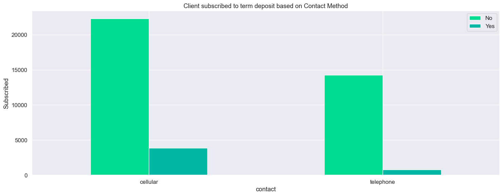

# Bank Classification
GitHub Repository for work done on Professional Certificate in Machine Learning and Artificial Intelligence - Mar - 2025

# Practical Application Assignment 17.1: What Drives the Deposits?

**Contents**

 * [Introduction](#Introduction)
 * [How to use the files in this repository?](#how-to-use-the-files-in-this-repository)
 * [Business Understanding](#Business-Understanding)
 * [Data Understanding](#Data-Understanding)
 * [Data Preparation](#Data-Preparation)
 * [Regression Model](#Regression-Model)
 * [Findings](#Findings)
 * [Next steps and Recommendations](#Next-steps-and-Recommendations)
 * [License](#license)
 
## Introduction

This repository contains the Jupyter Notebook for the Application Assignment 17.1. This takes a sample jupyter notebook to complete the exercise to analyse UCI Bank Marketing Data Set in bank-additional-full.csv file in the data folder of this repository to build a machine learning application that uses classifications to evaluate customers that will accept the Long-term deposit application using features like job, marital status, education, housing and personal loan.

The goal of this project is to compare the performance of the following classifiers namely

K Nearest Neighbor
Logistic Regression
Decision Trees and
Support Vector Machines
In comparing the models, the training times and accuracy of the models will be recorded. This should provide an indication on the model that will provide predictions to determine which customer will accept the long term deposit bank product via a phone based marketing campaign.

## How to use the files in this repository?

The notebooks are grouped into the following categories:
 * ``data`` – bank-additional-full.csv data file from UCI Bank Marketing Data Set used in the notebooks
 * ``notebook`` – Bank Classifier Analysis Notebook

## Business Understanding

For this application, we are using classfication in Machine Learning as we are comparing classsifiers. Classification is a supervised machine learning method where the model tries to predict the correct label of a given input data. In classification, the model is fully trained using the training data, and then it is evaluated on test data before being used to perform prediction on new unseen data.

### Business Objective Definition
This dataset was provided for a Portugese banking institution and is a collection of the results of multiple marketing campaigns.  The analysis of the data shows that the marketing campaign was not very successful in getting customers to sign up for the long term deposit product.

From a business objective, the task of this Machine Learning project is to determine which factors could lead to a higher success rate, for example,

- How does loan products have a positive impact on customer success rate?, for example, do we concentrate on customers with Housing loan?
- Are we going to have a better success rate with customers with “university degree”?
- How does the contact method (i.e., cellular) affect whether the success rate for long term loan products?

## Data Understanding

Examining the data, it does not have missing values in the columns/features. Reviewing the features of the datasets like job, marital status, education, housing and personal loans to check if this has an impact on the customers where the marketing campaign was successful.

Displayed below are some charts providing visualization on some of the observations of the dataset:

The dataset is heavily imbalanced towards people not getting terms deposits.

The dataset indicates that there is a strong preference towards a university degree.

The dataset also indicates that there is a strong preference for people with cellphones.

## Data Preparation

Apart from the imbalanced nature of the dataset, the following was done to prepare the dataset for modeling:

- Renamed "Y" feature to "deposit" to make it more meaningful
- Use features 1 - 7 (i.e., job, marital, education, default, housing, loan and contact ) to create a feature set
- Use ColumnTransformer to selectively apply data preparation transforms, it allows you to apply a specific transform or sequence of transforms to just the numerical columns, and a separate sequence of transforms to just the categorical columns
- Use LabelEncoder to encode labels of the target column
- Once the dataset was prepared, split it into a train and test set. Next, we will split the data into a training set and a test set using the train_test_split function. We will use 30% of the data as the test set

## Baseline Models

For the baseline model, decided to use a DecisionTreeClassifer which is a class capable of performing multi-class classification on a dataset. This Classifier has the ability to using different feature subsets and decision rules at different stages of classification.

This model will be compared with Logistic Regression model which is used to describe data and the relationship between one dependent variable and one or more independent variables.

Logistic Regression Machine Learning is quite fascinating and accomplishes some things far better than a Decision Tree when you possess a lot of time and knowledge. A Decision Tree's second restriction is that it is quite costly in terms of the sample size.

In training, fitting and predicting both models on the dataset, the following results were observed:

|Model Name	|Accuracy	|Precision	|Recall	|F1_Score	|Fit Time (ms)
|---------- |:----------|:-------|:---------|:--------|:-------------:|
|Decision Tree	|0.887513	|0.443792	|0.499954	|0.470202	|128|
|Logistic Regression	|0.887594	|0.443797	|0.500000	|0.470225	|193|

Quick review of this results show that accuracy scores were very close with numbers over 85%, however the recall, precision and F1_Score were below 50%.

This means the classifier has a high number of False negatives which can be an outcome of imbalanced class or untuned model hyperparameters. More likely because of the imbalanced dataset with a higher number of Deposit = "No" records.

## Findings

In this section, we will compare the performance of the Logistic Regression model to our KNN algorithm, Decision Tree, and SVM models. Using the default settings for each of the models, fit and score each. Also, be sure to compare the fit time of each of the models.

|Model Name	|Train Time (s)	|Train Accuracy	|Test Accuracy
|-----------|:--------------|:--------------|:------------:|
|Logistic Regression	|27|	0.887	|0.887|
|KNN	|142	|0.885	|0.885|
|Decision Tree |4.59	|0.887	|0.887|
|SVM	|241	|0.887	|0.887|

Looking at the results from the model comparison, Decision Tree had the best numbers across the three metrics with lowest train time in seconds, highest training and testing accuracy scores.

## Next Steps and Recommendations

The main question that I have is the imbalanced dataset which is heavily weighted towards the unsuccessful marketing campaigns. If the model is used to determine features that are making the marketing campaign unsuccessful, then the models above could be useful.

Alternatively, the model can be used by the financial institution to understand customer profile that they need to target, for example, there was a high score amongst the "Yes" for customers contacted via Cellular so maybe the Bank can adopt modern features like Text Messages, Social Media platforms (i.e. Facebook, Instagram, Twitter, Tik Tok etc) for marketing campaigns.

## License

Open source projects are made available and contributed to under licenses that include terms that, for the protection of contributors, make clear that the projects are offered “as-is”, without warranty, and disclaiming liability for damages resulting from using the projects.
